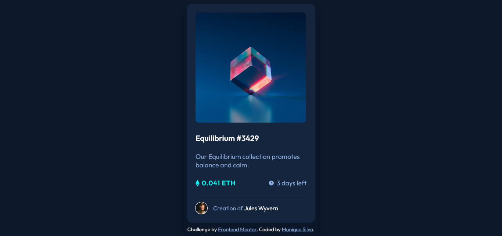

# Frontend Mentor - NFT preview card component solution

This is a solution to the
[NFT preview card component challenge on Frontend Mentor](https://www.frontendmentor.io/challenges/nft-preview-card-component-SbdUL_w0U).
Frontend Mentor challenges help you improve your coding skills by building
realistic projects.

## Table of contents

- [Overview](#overview)
  - [The challenge](#the-challenge)
  - [Screenshot](#screenshot)
  - [Links](#links)
- [My process](#my-process)
  - [Built with](#built-with)
  - [What I learned](#what-i-learned)
  - [Useful resources](#useful-resources)
- [Author](#author)

## Overview

### The challenge

Users should be able to:

- View the optimal layout depending on their device's screen size
- See hover states for interactive elements

### Screenshot

### Links

- [Solution](https://www.frontendmentor.io/solutions/nft-preview-card-component-C0FVe1Dd8)
- [Live Site](https://mss-nft-preview-card.netlify.app/)

## My process

### Built with

- Semantic HTML5 markup
- CSS custom properties
- Flexbox
- Mobile-first workflow
- [Vue](https://v3.vuejs.org/) - JS library
- [SASS](https://sass-lang.com/) - CSS preprocessor 

### What I learned

Still in the process of learning Vue, this project gave me a good understanding of Vue structure. It was also my first time using SASS in a project and I really liked it, I'll use it more often.
...and learned how to use pseudo-elements to smooth hover transitions.

### Useful resources

- [Vue Sass Tutorial Tricks](https://youtu.be/agaC4oKn_0k) - Not much for the video, but the comments section helps me fix an error with Vue/Sass that I wasn't able to resolve.
- [Learn Sass In 20 Minutes](https://youtu.be/Zz6eOVaaelI) - In fact it helped me learn all the sass I needed.

## Author

- Linkedin - [Monique Santos](https://www.linkedin.com/in/moniquesilva95/)
- Frontend Mentor - [@moniquedsilva](https://www.frontendmentor.io/profile/moniquedsilva)
- Twitter - [@moniquesdsilva](https://twitter.com/moniquesdsilva)
